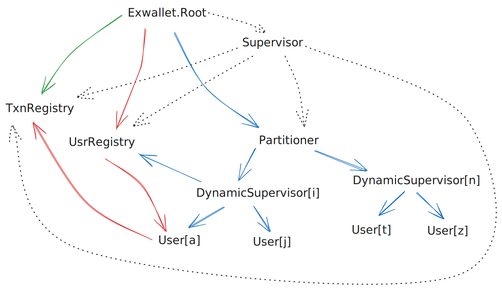

# ExWallet

A coding exercise to test engineering skills in Elixir. This should help show acumen in interpreting and implementing specification and mitigating if not eliminating undefined behavior.

In particular, this project was partial requirement in a job application to a company I will not be naming, to be fair to myself and to other future applicants who may be doing the same exercise.

## Original Requirements
1. Debit and credit operations must be idempotent; there is a `transaction_uuid` included in every request to help with this
2. Duplicate requests (all same parameters) must return same response as original
3. Duplicate requests (different param but reuse transaction_uuid) must return an error
4. Debit requests that have larger amount than current balance must return an error
5. Debit and credit requests must be made against same currency, in this exercise only `USD`
6. In the cases of (4) and (5) failed requests, the client is free to reuse `transaction_uuid` and the implementation must be able to handle such scenario
7. Must be performant and handle 80% correctness and load testing done by the submission review

## Architecture

### Start up (white broken lines)
- `ExWallet.Root` starts `ExWallet.Transaction.Registry`, `ExWallet.User.Registry` and `ExWallet.Partitioner` under a Supervisor.

### User creation (blue lines)
- For every user, `ExWallet.Root` finds the appropriate DynamicSupervisor via `ExWallet.Partitioner` and issues request to create a `ExWallet.User` under it with a name registered to `ExWallet.User.Registry`.

### Duplicate Debit or Credit transaction (green lines)
- `ExWallet.Root` checks `ExWallet.Transaction.Registry` if a previous transaction with the same *transaction_uuid* has already been processed and if found, returns the recorded response synchronously.

### New Debit or Credit transaction (red lines)
- Otherwise, the `ExWallet.Root` issues an asynchronous message to `ExWallet.User`, with `ExWallet.User` replying directly to the client (not pictured here) once it's processed the transaction.