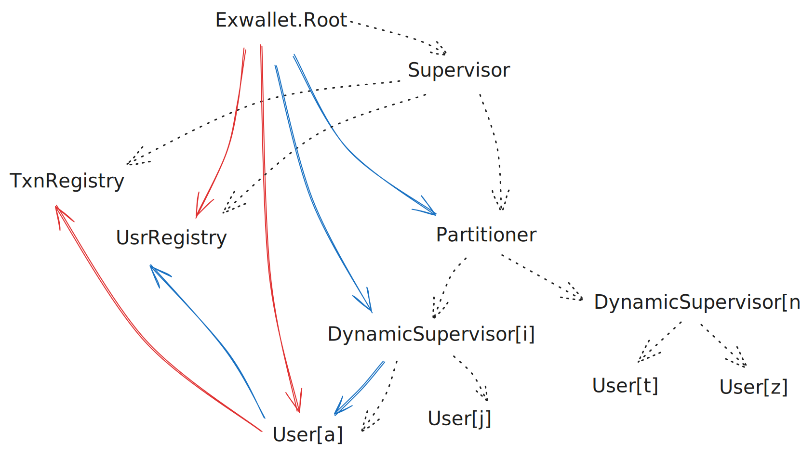

# Exwallet

An in-memory debit/credit wallet application. This does not include transaction semantics between user wallets.

This repo is a coding exercise submitted as a requirement for a job application to gauge software design and engineering skills in Elixir.

## Requirements
1. Satisfy the following API
```elixir
@doc """
Start a linked and isolated supervision tree and return the root server that
will handle the requests.
"""
@spec start :: GenServer.server()

@doc """
Create non-existing users with currency as "USD" and amount as 100_000.

It must ignore empty binary `""` or if the user already exists.
"""
@spec create_users(server :: GenServer.server(), users :: [String.t()]) :: :ok

@doc """
The same behavior is from `POST /transaction/bet` docs.

The `body` parameter is the "body" from the docs as a map with keys as atoms.
The result is the "response" from the docs as a map with keys as atoms.
"""
@spec bet(server :: GenServer.server(), body :: map) :: map

@doc """
The same behavior is from `POST /transaction/win` docs.

The `body` parameter is the "body" from the docs as a map with keys as atoms.
The result is the "response" from the docs as a map with keys as atoms.
"""
@spec win(server :: GenServer.server(), body :: map) :: map
```
2. Debit and credit operations must be idempotent; there is a `transaction_uuid` included in every request to help with this
3. Duplicate requests (all same parameters) must return same response as original
4. Duplicate requests (different param but reuse transaction_uuid) must return an error
5. Debit requests that have larger amount than current balance must return an error
6. Debit and credit requests must be made against same currency, in this exercise only `USD`
7. In cases of failed requests for (5)-(7), the client is free to reuse `transaction_uuid` and the implementation must be able to handle such scenario
8. Must be performant and handle 80% correctness and load testing done by the submission review

## Architecture



### Supervision tree (black broken lines)
- `Exwallet.Root` starts `Exwallet.Transaction.Registry`, `Exwallet.User.Registry` and `Exwallet.Partitioner` under a Supervisor. `Exwallet.Partitioner` supervises a set of DynamicSupervisors which in turn handles a dynamic set of `Exwallet.User` GenServers.

### User creation (blue lines)
- For every user, `Exwallet.Root` finds the appropriate DynamicSupervisor via `Exwallet.Partitioner` and issues request to create a `Exwallet.User` under it with a name registered to `Exwallet.User.Registry`.

### Duplicate Debit or Credit transaction (green lines)
- `Exwallet.Root` checks `Exwallet.Transaction.Registry` if a previous transaction with the same *transaction_uuid* has already been processed and if found, returns the recorded response synchronously.

### New Debit or Credit transaction (red lines)
- Otherwise, the `Exwallet.Root` issues an asynchronous message to `Exwallet.User`, with `Exwallet.User` replying directly to the client (not pictured here) once it's processed the transaction.